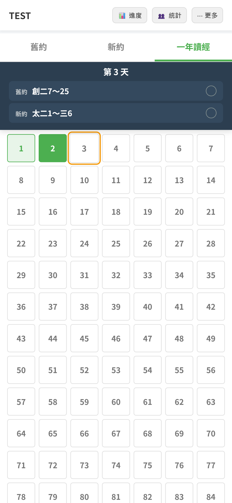

# 📖 聖經讀經打卡

一個以 LINE Bot + Google Apps Script (GAS) 製作的聖經讀經打卡應用，幫助群組成員記錄每日讀經、追蹤完成度，並查看群組統計排名。


## ✨ 功能特色

- **自由讀經** — 從舊約 39 卷 / 新約 27 卷中任意選取章節打卡
- **一年讀經計畫** — 內建 364 天讀經計畫，每日包含舊約與新約進度
- **智慧去重** — 自由讀經與一年計畫的章節自動合併，不重複計算
- **個人進度儀表板** — 即時查看舊約、新約及一年計畫的完成百分比
- **群組成員統計** — 查看同群組所有成員的閱讀排名與進度
- **LINE Bot 整合** — 在 LINE 群組輸入 `/GET URL` 即可取得專屬讀經連結
- **離線快取** — 透過 localStorage 實現零等待登入與進度載入
- **PIN 驗證** — 4 位數字密碼搭配 SHA-256 雜湊，保護個人資料

## 🏗️ 技術架構

| 層級 | 技術 |
|------|------|
| 前端 | 單頁 HTML + Vanilla JS + CSS（Mobile-first RWD） |
| 後端 | Google Apps Script (GAS) |
| 資料庫 | Google Sheets（Progress / Users / Stats 三張工作表） |
| 訊息整合 | LINE Messaging API（Webhook + Reply） |
| 部署 | GAS Web App（`doGet` 渲染頁面、`doPost` 處理 Webhook） |

## 📁 專案結構

```
bible-tracker/
├── index.html      # 前端 SPA（UI + 業務邏輯）
├── backend.gs      # Google Apps Script 後端
└── README.md
```

## 🚀 部署步驟

### 1. 建立 Google Apps Script 專案

1. 前往 [Google Apps Script](https://script.google.com/) 建立新專案
2. 將 `backend.gs` 的內容貼入 `Code.gs`
3. 新增 HTML 檔案 `index`，將 `index.html` 的內容貼入

### 2. 設定 Google Sheets

專案首次執行時會自動建立以下工作表：

- **Progress** — 儲存所有讀經紀錄 `[UserID, GroupID, Book, Chapter, Timestamp]`
- **Users** — 儲存用戶帳號 `[Username, PIN_Hash, UserID]`
- **Stats** — 統計快取 `[GroupID, UserID, OT, NT]`

### 3. 設定指令碼屬性

在 GAS「專案設定 → 指令碼屬性」中設定：

| 屬性名稱 | 說明 |
|----------|------|
| `LINE_CHANNEL_ACCESS_TOKEN` | LINE Channel Access Token |
| `WEBAPP_URL` | GAS 部署後的 Web App URL（`exec` 結尾） |

### 4. 部署 Web App

1. 點擊「部署 → 新增部署作業」
2. 類型選擇「網頁應用程式」
3. 存取權限設為「所有人」
4. 複製部署 URL，填入指令碼屬性的 `WEBAPP_URL`

### 5. 設定 LINE Bot

1. 在 [LINE Developers Console](https://developers.line.biz/) 建立 Messaging API Channel
2. 將 GAS 部署 URL 設為 Webhook URL
3. 將 Bot 加入 LINE 群組
4. 群組中輸入 `/GET URL` 取得專屬讀經連結

## 📱 使用方式

1. 透過 LINE 群組的專屬連結開啟 Web App
2. 輸入姓名與 4 位數字密碼登入（首次使用自動建立帳號）
3. 選擇「舊約」/「新約」自由讀經，或切換「一年讀經」跟隨計畫
4. 勾選已讀章節後儲存
5. 點擊「📊 進度」查看個人完成度
6. 點擊「👥 統計」查看群組成員排名

## 📄 授權

MIT License